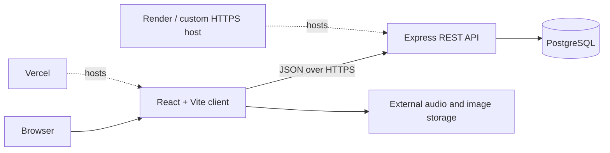

<p align="center">
  
</p>

# SOBERRY

SOBERRY is a full-stack music discovery and playback application built with React, Express, and PostgreSQL. It provides account creation, music search and browsing, artist and genre views, playback controls, recently played tracks, and a personal liked-music state.

> **Project status:** Portfolio prototype. The public deployment is available for demonstration, but the current authentication and administration flows require additional security controls before production use.

[Open the live demo](https://soberry.vercel.app/) · [View the API health endpoint](https://soberry-2.onrender.com/)

Deployment status was manually checked on 14 July 2026: both the frontend and the primary API health endpoint returned HTTP 200. Availability may vary because the services use third-party hosting and storage.

## Features

- Responsive music-library interface with persistent playback controls
- User registration and password-based login
- Password hashing with bcrypt before database storage
- Music and artist search
- Artist, album, genre, latest-music, and explore views
- Recently played and queued-track state managed in the browser
- Like and unlike operations tied to a user account
- Administrative forms for adding artists and tracks
- PostgreSQL-backed REST API

## Architecture



The repository contains two independently installed applications:

| Component | Location | Responsibility |
|---|---|---|
| Web client | `Client/` | React UI, routing, playback, search, user interaction, and browser-side state |
| API server | `server/` | Express routes, authentication operations, catalogue queries, and PostgreSQL access |
| Media | External URLs | Audio files, artwork, and artist imagery referenced by database records |

## Technology stack

| Layer | Technologies |
|---|---|
| Frontend | React 18, Vite 4, React Router, Zustand, Redux Toolkit, Axios |
| Interface | Tailwind CSS, Ant Design, Emotion, Tabler Icons |
| Playback | HTML audio element, React Player, use-sound |
| Backend | Node.js, Express, CORS, Helmet, dotenv |
| Authentication | PostgreSQL user records and bcrypt password hashing |
| Database | PostgreSQL through the `pg` connection pool |
| Deployment | Vercel frontend; Render and legacy custom-host API references |
| Analytics | Vercel Analytics |

## Repository structure

```text
SOBERRY/
├── Client/
│   ├── public/              # Static client assets
│   ├── src/
│   │   ├── Component/       # Reusable player, card, form, and navigation UI
│   │   ├── Scene/           # Route-level views
│   │   └── State/           # Zustand playback state
│   ├── package.json
│   └── vite.config.js
├── server/
│   ├── Apis/                # PostgreSQL query and mutation handlers
│   ├── models/              # Earlier Mongoose model definitions
│   ├── index.js             # HTTPS entry point requiring local TLS certificates
│   ├── locals.js            # HTTP entry point for local/deployed platform use
│   └── package.json
└── LICENSE                  # GNU GPL version 3
```

The active API implementation uses PostgreSQL. The Mongoose models remain from an earlier implementation and are not used by the current route handlers.

## Local setup

### Prerequisites

- Node.js 18 or newer
- npm
- A PostgreSQL database accessible over SSL
- Database tables matching the contract described below

### 1. Clone the repository

```bash
git clone https://github.com/goutham-1902/SOBERRY.git
cd SOBERRY
```

### 2. Configure and start the API

```bash
cd server
cp .env.example .env
npm ci
npm start
```

Complete `server/.env` with your PostgreSQL credentials:

```dotenv
POST_USER=postgres
POST_HOST=your-postgres-host
POST_DATA=soberry
POST_PASSWORD=replace-with-a-secret
POST_PORT=5432
```

`npm start` runs `server/locals.js` on port `3000`. The separate `npm run start:https` command runs `server/index.js`, which expects Let's Encrypt certificate files at the paths currently defined in that file. Use the HTTP entry point behind a managed TLS reverse proxy for ordinary local or platform deployment.

### 3. Start the client

In a second terminal:

```bash
cd Client
npm ci
npm run dev
```

Vite serves the client at `http://localhost:5173` by default.

The current client source contains production API URLs in multiple components. For a fully local stack, replace those `mainurl` constants and legacy endpoint references with `http://localhost:3000`. Centralizing them behind a single `VITE_API_BASE_URL` variable is listed as planned work.

## Expected database contract

Database migration and seed scripts are not yet included. The current API expects the following PostgreSQL records:

| Table | Fields used by the application |
|---|---|
| `artist` | `artistkey`, `img`, `name` |
| `music` | `key`, `album`, `artist`, `artistkey`, `genre`, `img`, `src`, `title` |
| `users` | `user_id`, `name`, `email`, `password` |
| `likedmusic` | `userid`, `songid` |

`genre` and `artistkey` are queried with PostgreSQL array operators in parts of the API. Reproducing the database therefore requires compatible array column types and constraints. A versioned schema migration should be added before treating the setup as fully reproducible.

## API reference

### Read and discovery routes

| Method | Route | Purpose |
|---|---|---|
| `GET` | `/` | API health response |
| `GET` | `/artist` | Return all artists |
| `GET` | `/artistlimit` | Return up to ten artists |
| `GET` | `/artist/:artistkey` | Return music associated with an artist |
| `GET` | `/allmusic` | Return the music catalogue |
| `GET` | `/allmusic/:user` | Return catalogue entries with liked state for a user |
| `GET` | `/allmusiclim/:user` | Return up to ten entries with liked state |
| `GET` | `/latest` | Return up to ten music records |
| `GET` | `/getgenre/:genre` | Return up to ten records for a genre |
| `GET` | `/getgenreall/:genre` | Return all records for a genre |
| `POST` | `/search` | Search music titles and artist names using `searchQuery` |

### Account and mutation routes

| Method | Route | Purpose |
|---|---|---|
| `POST` | `/add` | Create a user and hash the supplied password |
| `POST` | `/login` | Validate email and password credentials |
| `POST` | `/likemusic` | Associate a song with a user |
| `POST` | `/removelike` | Remove a liked-song association |
| `POST` | `/addartist` | Add an artist record |
| `POST` | `/addmusic` | Add a music record |

## Security and production-readiness

This codebase should be treated as a learning and portfolio project. Before production deployment:

- Replace identifier cookies with signed, secure, HTTP-only session cookies or a reviewed token-based flow.
- Add authorization to artist and music administration routes.
- Validate and normalize request bodies using a schema-validation library.
- Parameterize every database query and review error responses.
- Restrict CORS to approved frontend origins.
- Add rate limiting, CSRF protection where applicable, and account-abuse controls.
- Move API URLs and TLS paths into environment-specific configuration.
- Add database migrations, automated tests, dependency updates, and CI checks.
- Review the rights and permitted distribution of all externally hosted audio and artwork.

Do not commit `.env` files or production credentials. Only the variable names and placeholders in `.env.example` are intended for version control.

## Known limitations

- API base URLs are duplicated across frontend files.
- The repository does not include a PostgreSQL schema, migrations, seed data, or an automated test suite.
- The client defines a lint command but does not yet include an ESLint configuration file.
- The locked client and server dependency trees currently report security advisories and require a reviewed upgrade pass.
- Several dependencies and UI paths reflect earlier experiments, including unused Mongoose models and legacy API hosts.
- The “forgot password” link does not currently implement account recovery.
- The demonstration depends on external media URLs that may change or become unavailable.

## Verification status

The following checks were run on 14 July 2026 after the documentation update:

| Check | Status |
|---|---|
| Clean client dependency installation | Passed |
| Vite production build | Passed |
| Server JavaScript syntax checks | Passed |
| Local API start and `/` health response | Passed |
| Automated tests | Not implemented |
| Client linting | Not configured; the existing command cannot locate an ESLint configuration |
| Dependency audit | Action required; outstanding npm advisories remain |

## Roadmap

- Centralize client configuration with `VITE_API_BASE_URL`
- Add SQL migrations and a small license-safe seed dataset
- Add authenticated role-based administration
- Add backend and component tests with CI
- Configure ESLint and resolve the existing source warnings
- Review and upgrade vulnerable dependencies without forcing breaking changes
- Replace browser-readable identifier cookies with secure sessions
- Add screenshots and a short demonstration recording
- Add accessibility, responsive-layout, and playback-state testing

## Author

**Goutham SDS Kodali**

- [LinkedIn](https://www.linkedin.com/in/sds-kodali/)
- [GitHub](https://github.com/goutham-1902)

Questions, feedback, and collaboration enquiries are welcome through LinkedIn.

## License and media rights

The original code in this repository is licensed under the [GNU General Public License v3.0](LICENSE). The package manifests use the SPDX identifier `GPL-3.0-only` to match the included version-3 license text.

The GPL applies to the repository's original source code. It does not automatically grant rights to third-party music, recordings, album artwork, artist photographs, fonts, or other externally hosted material. Those assets remain subject to their respective owners' terms and must not be redistributed without permission.
